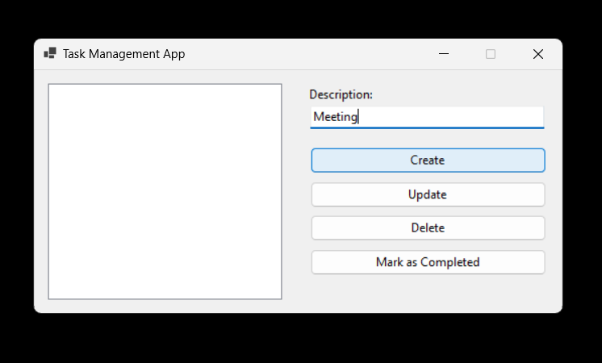

# TaskManagementApp
A basic task management application using C# and .NET Framework. The application should allow users to create, update, and delete tasks, as well as mark them as completed. GitHub Copilot is used to generate code for implementing CRUD operations, input validation, and user interface design.

# Images

### Create Task

